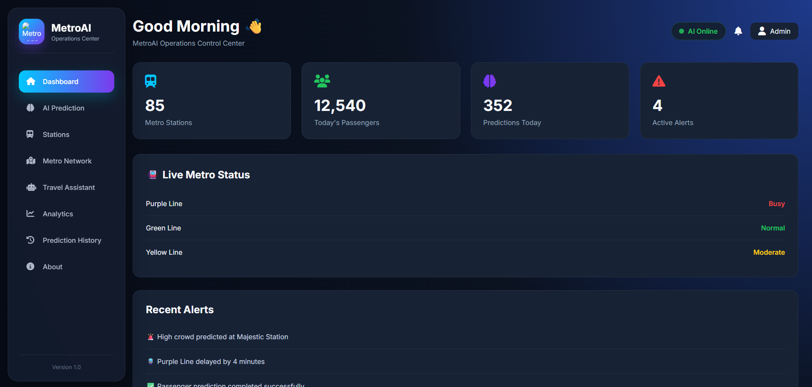
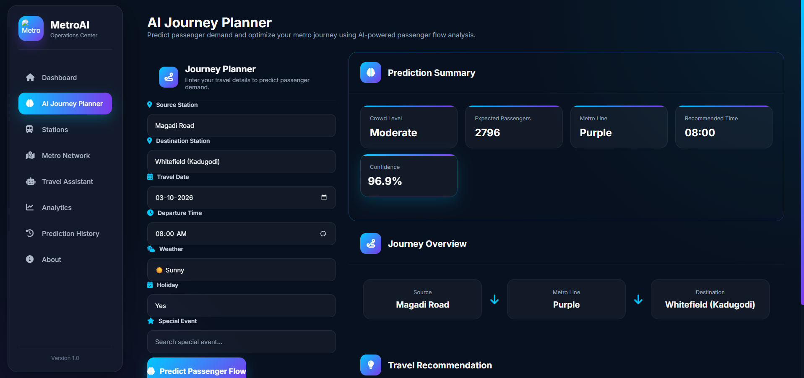

# 🚇 MetroAI

### AI-Powered Metro Operations & Passenger Assistance System

> 🚧 **Work in Progress:** MetroAI is currently under active development.
> The current implementation focuses on passenger demand prediction,
> journey planning, and the initial operations dashboard. Additional
> modules are being developed progressively.

---

## 📌 Overview

MetroAI is an AI-powered metro operations and passenger assistance
system designed to analyze passenger demand and provide intelligent
insights for metro operations and passenger journey planning.

The project combines machine learning, passenger-flow data, and a
web-based Flask application to provide demand predictions and
metro operation insights.

The long-term goal of MetroAI is to support smarter metro operations
and provide passengers with useful information for planning their
journeys.

---

## 📸 Current Progress

MetroAI is currently in active development. The following screenshots
show the main modules that have been implemented so far.

### 🚇 Operations Dashboard

The MetroAI Operations Dashboard provides an overview of metro
operations, including station information, passenger activity,
prediction statistics, metro-line status, and operational alerts.



---

### 🤖 AI Journey Planner

The AI Journey Planner allows users to enter journey-related
information such as source station, destination station, travel
date, departure time, weather conditions, holidays, and special
events.

The system then provides passenger-demand prediction results
including crowd level, expected passengers, metro line,
recommended travel time, and prediction confidence.



---

## ✨ Current Features

### 🤖 Passenger Demand Prediction

Uses a machine learning model to predict passenger demand based
on available passenger-flow data and journey-related parameters.

### 🚇 Operations Dashboard

Provides an overview of metro stations, passenger activity,
predictions, metro-line status, and operational alerts.

### 🧭 AI Journey Planner

Allows users to enter journey details and receive passenger-demand
predictions and travel-related insights.

### 📊 Passenger Flow Analysis

Processes passenger-flow information for use in prediction and
analysis.

### 🗺️ Metro Data Processing

Includes metro station and network-related data for future
analysis and intelligent passenger assistance.

---

## 🧠 Machine Learning

MetroAI currently uses a **Random Forest** machine learning model
for passenger demand prediction.

### Prediction Workflow

```text
Passenger & Journey Data
          ↓
     Data Processing
          ↓
    Feature Preparation
          ↓
   Random Forest Model
          ↓
 Passenger Demand Prediction
          ↓
   Dashboard / Journey Planner
